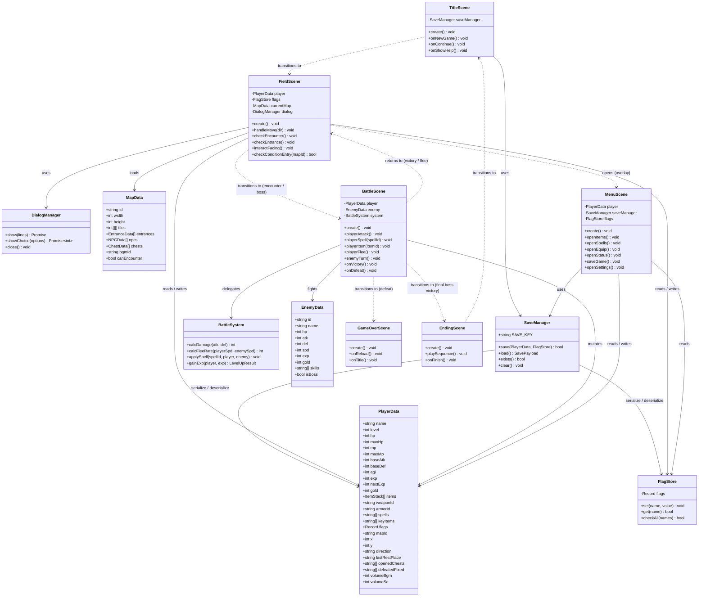
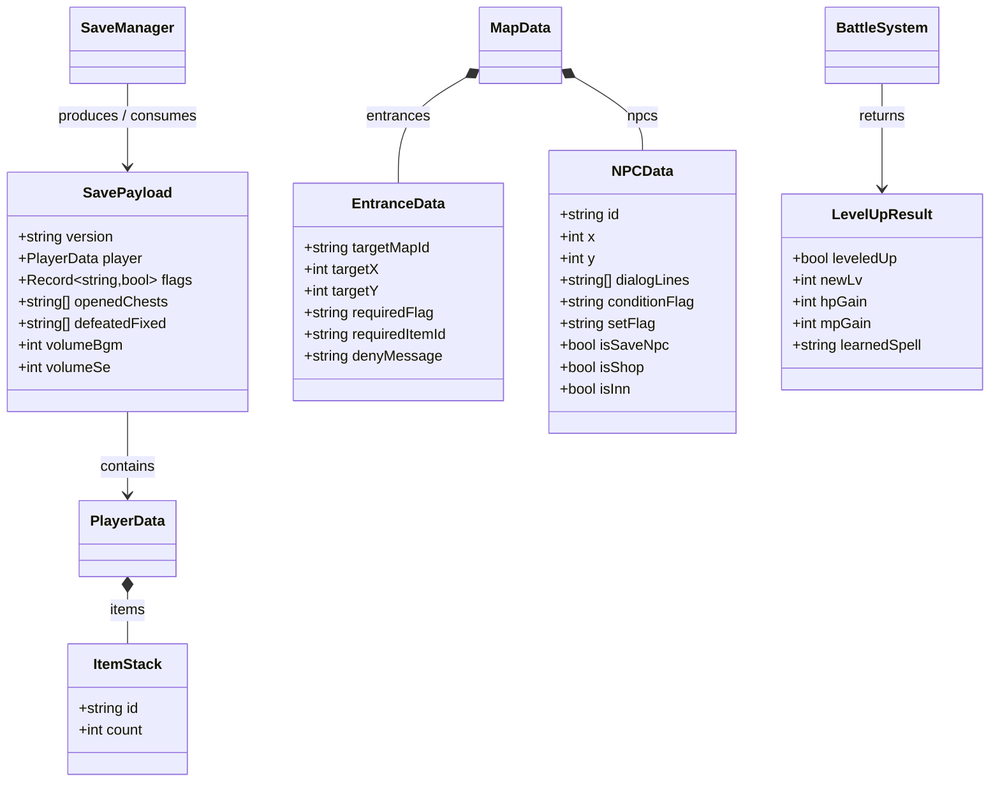

# CLASS.md — 暁の小径 クラス設計

## 概要

JavaScript (Phaser) を前提とした主要クラスと責務の定義。
各シーンは `Phaser.Scene` を継承し、マネージャー類は独立モジュールとして実装する。

---

## クラス図

---

## クラス責務サマリー

| クラス | 責務 |
|---|---|
| `PlayerData` | プレイヤーの全状態を保持するデータオブジェクト（DTO） |
| `FlagStore` | ゲーム進行フラグの読み書き。`checkAll` で複数フラグの同時確認が可能 |
| `SaveManager` | `path_of_dawn_save_v1` キーで LocalStorage に PlayerData + FlagStore を JSON 保存・読み込みする |
| `BattleSystem` | ダメージ計算・逃走成功率・術法効果・レベルアップ判定のロジックをシーンから分離した純粋関数群 |
| `DialogManager` | テキストウィンドウの表示・テキスト送り・選択肢表示を非同期 Promise で提供する |
| `EnemyData` | 敵の静的データ定義（ボス・通常敵共通） |
| `MapData` | タイルマップ・NPC・入口・宝箱・エンカウント設定を保持する |
| `TitleScene` | タイトル画面。新規ゲーム初期化または続きからロードを起点として FieldScene へ遷移する |
| `FieldScene` | ワールドマップ・各ローカルマップ上での移動・NPC会話・エンカウント・入口判定を担う |
| `BattleScene` | 1対1ターン制戦闘。コマンド受付・ダメージ処理・勝敗判定・報酬付与を行う |
| `MenuScene` | メニューオーバーレイ。装備変更・ステータス確認・セーブを提供する |
| `GameOverScene` | HP0による敗北後の画面。最後の記録から再開またはタイトルへ誘導する |
| `EndingScene` | ラスボス撃破後のエンディング演出とスタッフクレジットを表示しタイトルへ戻る |

---

## 主要データフロー

