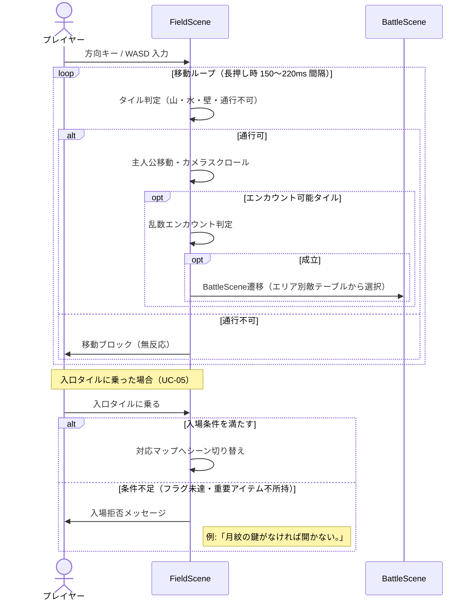
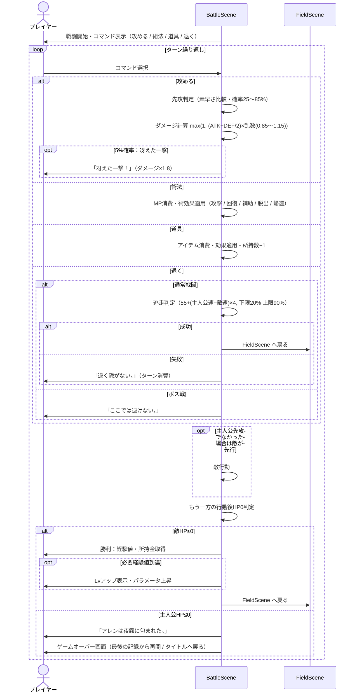
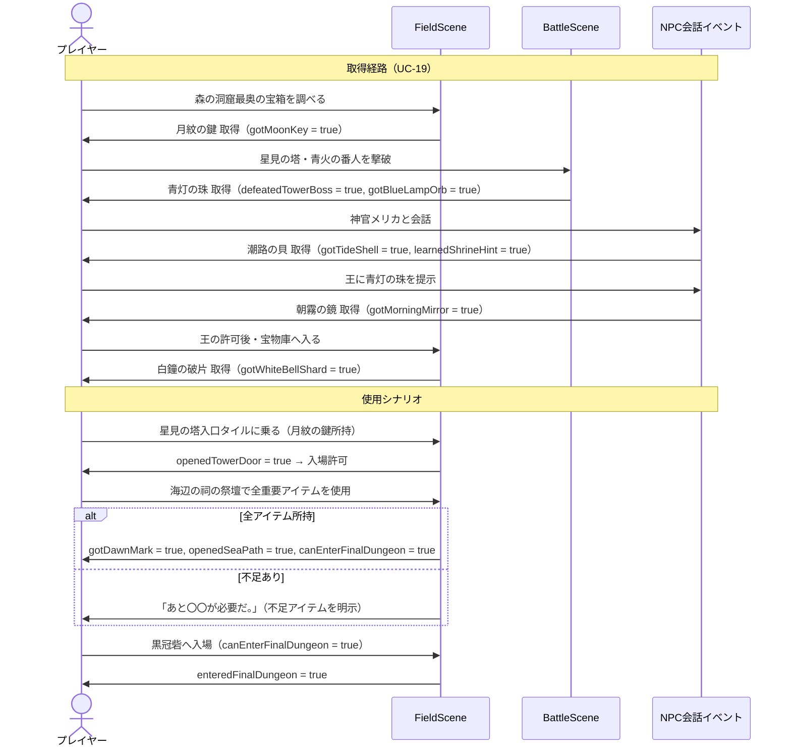

# SEQUENCE.md — 暁の小径 シーケンス定義

## 概要

主要フローを 6 つのシーケンス図で表す。各図は対応する UC を参照している。

| ID | タイトル | 対応 UC |
|---|---|---|
| SD-01 | タイトル画面〜ゲーム開始 | UC-01, UC-02, UC-03 |
| SD-02 | フィールド移動〜ランダムエンカウント | UC-04, UC-05, UC-07 |
| SD-03 | 戦闘メインフロー | UC-08, UC-09, UC-10, UC-11, UC-21 |
| SD-04 | セーブ・ロード | UC-17, UC-18 |
| SD-05 | 重要アイテム取得〜イベント進行 | UC-06, UC-19 |
| SD-06 | ラスボス戦〜エンディング | UC-20 |

---

## SD-01 タイトル画面〜ゲーム開始

```mermaid
sequenceDiagram
    actor Player as プレイヤー
    participant Title as TitleScene
    participant Field as FieldScene
    participant LS as LocalStorage

    Player->>Title: ブラウザでアクセス
    Title->>LS: セーブデータ確認（path_of_dawn_save_v1）
    alt セーブデータあり
        LS-->>Title: データ存在
        Title->>Player: メニュー表示（続きから：有効）
    else セーブデータなし
        LS-->>Title: データなし
        Title->>Player: メニュー表示（続きから：灰色）
    end

    alt 新しく始める
        Player->>Title: 「新しく始める」選択
        Title->>LS: 初期データ書き込み（HP24, MP6, Lv1, 80リム…）
        Title->>Field: FieldScene遷移（白鐘城）
        Field->>Player: 初期配置・ゲーム開始
    else 続きから
        Player->>Title: 「続きから」選択
        Title->>LS: セーブデータ読み込み
        alt データ正常
            LS-->>Title: データ返却
            Title->>Field: FieldScene遷移
            Field->>Player: 前回セーブ時の状態から再開
        else バージョン不一致・データ破損
            LS-->>Title: エラー
            Title->>Player: 警告表示後タイトルへ戻る
        end
    end
```

---

## SD-02 フィールド移動〜ランダムエンカウント



---

## SD-03 戦闘メインフロー



---

## SD-04 セーブ・ロード

```mermaid
sequenceDiagram
    actor Player as プレイヤー
    participant Menu as MenuScene
    participant Title as TitleScene
    participant Field as FieldScene
    participant LS as LocalStorage

    Note over Player, LS: セーブ（UC-17）
    Player->>Menu: 「記録」選択 または 記録係NPCと会話
    Menu->>Player: 「記録しますか？ はい / いいえ」
    alt はい
        Menu->>LS: path_of_dawn_save_v1 書き込み
        Note right of LS: プレイヤーデータ・マップID・座標・向き・所持アイテム・装備・重要アイテム・進行フラグ・宝箱状態・撃破済み固定敵・音量設定・最後に休んだ場所
        alt 書き込み成功
            LS-->>Menu: 完了
            Menu->>Player: 「記録しました。」
        else 書き込み失敗
            LS-->>Menu: エラー
            Menu->>Player: 「記録に失敗しました。ブラウザの保存設定を確認してください。」
        end
    else いいえ
        Menu->>Player: キャンセル（メニューへ戻る）
    end

    Note over Player, LS: ロード（UC-18）
    Player->>Title: 「続きから」選択
    Title->>LS: path_of_dawn_save_v1 読み込み
    alt データ正常・バージョン一致
        LS-->>Title: データ返却
        Title->>Field: FieldScene遷移
        Field->>Player: 前回セーブ時の状態から再開
    else バージョン不一致
        LS-->>Title: 不一致通知
        Title->>Player: 警告表示後タイトルへ戻る
    end
```

---

## SD-05 重要アイテム取得〜イベント進行



---

## SD-06 ラスボス戦〜エンディング

```mermaid
sequenceDiagram
    actor Player as プレイヤー
    participant Field as FieldScene
    participant Battle as BattleScene
    participant Ending as EndingScene
    participant Title as TitleScene

    Player->>Field: 黒冠砦最奥に到達
    Field->>Player: ラスボス前警告メッセージ
    Field->>Battle: ボス戦開始（黒冠卿オルヴェス 第1形態 HP260）

    loop 第1形態戦闘
        Battle->>Battle: 通常戦闘と同ロジック（逃走不可）
    end

    Battle->>Battle: 第1形態HP0
    Battle->>Player: 形態移行演出
    Battle->>Battle: 最終形態「夜明け喰らい」開始（HP340）

    loop 最終形態戦闘
        Battle->>Battle: 通常戦闘と同ロジック（逃走不可）
    end

    Battle->>Battle: 最終形態HP0
    Battle->>Player: defeatedFinalBoss = true
    Battle->>Ending: EndingScene へ遷移

    Ending->>Player: エンディングテキスト・演出表示
    Player->>Ending: Enter / Space で決定
    Ending->>Title: TitleScene へ遷移
```
