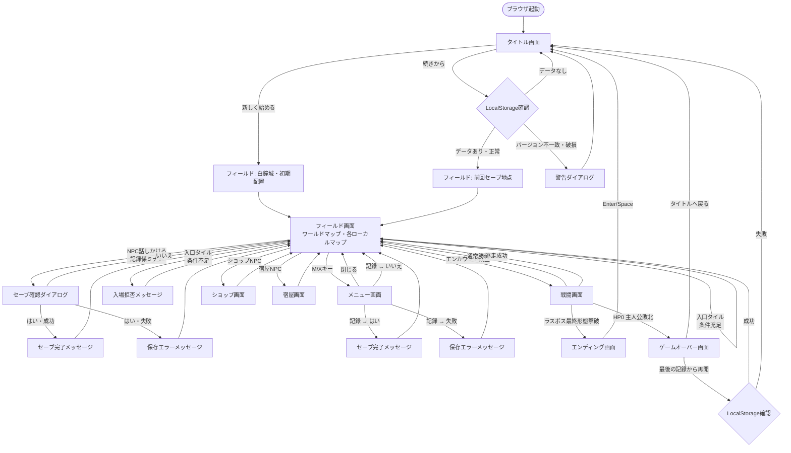

# UI.md — 暁の小径 画面設計

## 画面遷移図

---

## 各画面の詳細

### タイトル画面（TitleScene）

| 要素 | 内容 |
|---|---|
| タイトルロゴ | 「暁の小径 / Path of Dawn」 |
| メニュー | 新しく始める / 続きから / 操作説明 / クレジット |
| 「続きから」状態 | セーブデータなし → グレーアウト、選択時「記録がありません。」 |
| BGM | タイトル BGM |

**例外状態:**
- セーブデータなし: 「続きから」選択不可・グレーアウト表示
- セーブデータ破損/バージョン不一致: 「続きから」後に警告ダイアログ → タイトルへ戻る

---

### フィールド画面（FieldScene）

| 要素 | 内容 |
|---|---|
| マップ表示 | タイルマップ（ワールドマップ / 各ローカルマップ） |
| 主人公スプライト | 4方向、歩行アニメ（理想版） |
| ステータス枠 | HP/MP/Lv/所持金（常時表示） |
| メッセージウィンドウ | NPC会話・イベント・入場拒否・説明テキスト表示用 |
| カメラ | ワールドマップでは主人公中心スクロール |

**例外状態:**
- 入口タイル・条件不足: 「月紋の鍵がなければ開かない。」等のメッセージを表示して移動ブロック
- 最初のNPC会話後・クエスト未受諾: セリフ分岐で誘導
- エンカウント可能タイル: 光粉使用中は遭遇率低下（プレイヤーには視覚的フィードバックなし、最小版）

---

### 戦闘画面（BattleScene）

| 要素 | 内容 |
|---|---|
| 敵スプライト | 中央または右寄り表示 |
| HP バー | 主人公HP（数値+バー）、敵HP（バーのみ、最小版） |
| コマンドウィンドウ | 攻める / 術法 / 道具 / 退く |
| メッセージウィンドウ | 行動・ダメージ・状態テキスト |
| 術法サブメニュー | 習得済み術一覧、MP不足術はグレーアウト |
| 道具サブメニュー | 所持アイテム一覧、所持数0はグレーアウト |

**例外状態:**
- MP不足: 術法グレーアウト・選択不可（「MPが足りない。」ではなく非活性化）
- 所持アイテム0: 道具選択不可
- ボス戦で「退く」: 「ここでは退けない。」を表示して行動キャンセル
- 逃走失敗: 「退く隙がない。」を表示してターン消費
- 主人公HP0: コマンド受付を終了してゲームオーバー遷移

---

### メニュー画面（MenuScene）

| 要素 | 内容 |
|---|---|
| メニュー項目 | 声をかける / 荷物 / 術法 / 装具 / 強さ / 周囲を見る / 記録 / 設定 |
| 装具サブ画面 | 武器/防具一覧、装備前後の攻防差分を表示 |
| 強さサブ画面 | 名前・Lv・HP/MP・攻防速・経験値・次Lvまで・所持金・装備・習得術・重要アイテム一覧 |
| 荷物サブ画面 | 所持アイテム名・所持数・効果説明 |
| 記録ダイアログ | 「記録しますか？ はい / いいえ」 |

**例外状態:**
- セーブ失敗: 「記録に失敗しました。ブラウザの保存設定を確認してください。」
- 所持アイテムなし: 荷物メニューで「持ち物はない。」
- 術法未習得: 術法メニューで「術法を知らない。」
- 「声をかける」で話しかけ対象なし: 「近くに話せる相手がいない。」

---

### ショップ画面（インライン）

| 要素 | 内容 |
|---|---|
| 商品一覧 | 名前・価格・現在の所持数 |
| 購入確認 | 「〇〇を買いますか？ はい / いいえ」 |
| 武器/防具購入後 | 「装備しますか？ はい / いいえ」 |

**例外状態:**
- 所持金不足: 「リムが足りないようだ。」
- 最大所持数超過: 「これ以上は持てません。」

---

### 宿屋画面（インライン）

| 要素 | 内容 |
|---|---|
| 宿泊確認 | 「一晩泊まります。〇〇リムです。 はい / いいえ」 |
| 宿泊後 | HP/MP全回復・毒解除・最後に休んだ場所を更新 |

**例外状態:**
- 所持金不足: 「リムが足りないようだ。」

---

### ゲームオーバー画面（GameOverScene）

| 要素 | 内容 |
|---|---|
| メッセージ | 「アレンは夜霧に包まれた。」 |
| 選択肢 | 最後の記録から再開 / タイトルへ戻る |
| BGM | ゲームオーバー BGM（短い余韻） |

**例外状態:**
- 「最後の記録から再開」でセーブデータ消失: タイトルへ強制遷移

---

### エンディング画面（EndingScene）

| 要素 | 内容 |
|---|---|
| 演出 | 黒画面から明転 → 白鐘城外観 → 町・村・祠の後日談 → 主人公帰還 |
| テキスト例 | 「長い夜は明けた。」「白鐘はふたたび朝を告げた。」 |
| 操作 | Enter / Space でタイトルへ戻る |

**例外状態:**
- エンディング演出中の誤操作: 演出完了前はキー入力を無視（または最終テキスト以降のみ受付）
