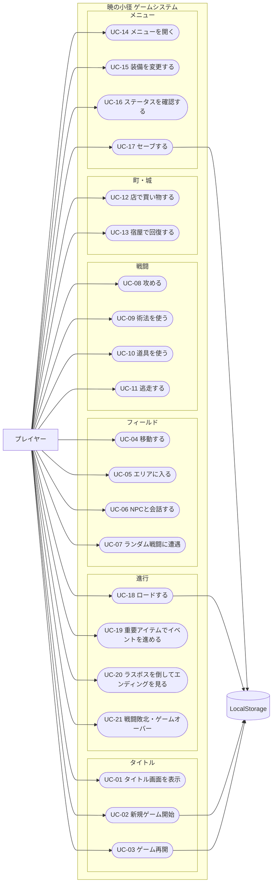

# USECASE.md — 暁の小径 ユースケース定義

## アクター

| アクター | 説明 |
|---|---|
| プレイヤー | ゲームをプレイする人間 |
| LocalStorage | セーブデータを保持するブラウザストレージ |

## ユースケース図

## ユースケース一覧

### UC-01 タイトル画面を表示する
- **アクター**: プレイヤー
- **事前条件**: ブラウザでゲームを開く
- **主フロー**: タイトルロゴ・サブタイトル・メニュー（新しく始める / 続きから / 操作説明 / クレジット）を表示する
- **代替フロー**: セーブデータがない場合、「続きから」を灰色表示にして選択時に「記録がありません。」を表示
- **事後条件**: メニューが選択可能な状態になる

### UC-02 新規ゲームを開始する
- **アクター**: プレイヤー、LocalStorage
- **事前条件**: タイトル画面が表示されている
- **主フロー**: プレイヤーデータを初期値で生成し、白鐘城の王の前に配置する
- **初期データ**: HP 24、MP 6、Lv 1、80リム、木彫りの短剣・旅布の上着・小癒し草×2
- **事後条件**: フィールド（白鐘城）でゲームが始まる

### UC-03 ゲームを再開する（続きから）
- **アクター**: プレイヤー、LocalStorage
- **事前条件**: LocalStorage（キー: `path_of_dawn_save_v1`）にセーブデータが存在する
- **主フロー**: データを読み込み、前回セーブ時の状態から再開する
- **代替フロー A**: バージョン不一致の場合は警告表示後、タイトルへ戻る
- **代替フロー B**: データ破損の場合も警告表示後、タイトルへ戻る

### UC-04 フィールドを移動する
- **アクター**: プレイヤー
- **事前条件**: ワールドマップまたはローカルマップにいる
- **主フロー**: 方向キー / WASD で1マス移動する
- **壁判定**: 山・水・壁・通行不可フラグのタイルには進めない
- **連続移動**: 長押しで 150〜220ms 間隔で連続移動
- **カメラ**: ワールドマップでは主人公中心にマップをスクロール
- **付帯**: エンカウント可能タイル歩行時にランダムエンカウント判定（UC-07）

### UC-05 エリアに入る
- **アクター**: プレイヤー
- **事前条件**: 入口タイルに乗る
- **主フロー**: 対応するマップ（城・町・洞窟・塔・祠・砦）へシーンを切り替える
- **代替フロー**: 条件不足時（フラグ未達・重要アイテム不所持）はメッセージを表示して入場拒否
  - 星見の塔: `月紋の鍵` が必要
  - 黒冠砦: `canEnterFinalDungeon` が必要

### UC-06 NPCと会話する
- **アクター**: プレイヤー
- **事前条件**: NPC隣接・NPC方向を向いて決定キー（Enter / Space / Z）を押す
- **主フロー**: 進行フラグに応じたセリフを順に表示する（テキスト送りあり）
- **付帯**: 会話によりフラグが変化する場合がある（例: `learnedCaveHint = true`）
- **セーブNPC**: 記録係ミナトとの会話でセーブ処理（UC-17）が実行される

### UC-07 ランダム戦闘に遭遇する
- **アクター**: プレイヤー
- **事前条件**: エンカウント可能タイルを歩行中
- **主フロー**: 歩数ごとに乱数判定、成立したら BattleScene へ遷移する
- **出現敵**: エリア別テーブルから選択（草原・森・洞窟・山道・塔・砦で異なる）
- **軽減**: `光粉` 使用中は 80 歩間エンカウント率低下

### UC-08 攻める（通常攻撃）
- **アクター**: プレイヤー
- **事前条件**: BattleScene で自ターン、コマンド「攻める」を選択
- **主フロー**:
  1. 素早さで先攻判定（確率 25〜85%）
  2. ダメージ計算 = max(1, (攻撃力 − 防御力/2) × 乱数(0.85〜1.15))
  3. 5%確率で「冴えた一撃」（ダメージ×1.8）
  4. 敵HP0 → 勝利処理（経験値・所持金加算、レベルアップ判定）

### UC-09 術法を使う
- **アクター**: プレイヤー
- **事前条件**: 術を習得済み・MPが足りる
- **主フロー**: 術を選択してMP消費・効果を適用（攻撃 / 回復 / 補助 / 脱出 / 帰還）
- **代替フロー**: MP不足時はその術を灰色表示にして選択不可

### UC-10 道具を使う
- **アクター**: プレイヤー
- **事前条件**: アイテムを1個以上所持
- **主フロー**: アイテムを選択して効果を適用し、所持数を1減らす
- **代替フロー**: 所持数0のアイテムは選択不可

### UC-11 逃走する
- **アクター**: プレイヤー
- **事前条件**: 通常戦闘中（ボス戦でない）、コマンド「退く」を選択
- **逃走成功率**: 55 + (主人公速 − 敵速) × 4（下限 20%、上限 90%）
- **成功**: フィールドへ戻る
- **失敗**: 「退く隙がない。」を表示してターン消費
- **ボス戦**: 「ここでは退けない。」を表示して逃走不可

### UC-12 店で買い物をする
- **アクター**: プレイヤー
- **事前条件**: 店NPCに話しかける
- **主フロー**: 商品一覧（名前・価格・所持数）を表示 → 購入確認 → 所持金を減らしてアイテム追加
- **代替フロー A**: 所持金不足 → 「リムが足りないようだ。」
- **代替フロー B**: 最大所持数超過 → 「これ以上は持てません。」
- **武器/防具**: 購入後「装備しますか？」を確認

### UC-13 宿屋で回復する
- **アクター**: プレイヤー
- **事前条件**: 宿屋NPCに話しかけ、宿泊を選択
- **主フロー**: 料金支払い → HP/MP全回復・毒解除・最後に休んだ場所を更新

### UC-14 メニューを開く
- **アクター**: プレイヤー
- **事前条件**: フィールド / マップ上（戦闘中は戦闘コマンドを使用）
- **主フロー**: M / X キーでメニューを表示する
- **メニュー項目**: 声をかける / 荷物 / 術法 / 装具 / 強さ / 周囲を見る / 記録 / 設定

### UC-15 装備を変更する
- **アクター**: プレイヤー
- **事前条件**: メニューの「装具」を選択
- **主フロー**: 所持武器 / 防具の一覧を表示し、選択した装備に切り替える
- **表示**: 装備前後の攻撃力・防御力の差分を表示する

### UC-16 ステータスを確認する
- **アクター**: プレイヤー
- **事前条件**: メニューの「強さ」を選択
- **主フロー**: 名前・Lv・HP/MP・攻防速・経験値・次Lvまで・所持金・装備・習得術・重要アイテム一覧を表示

### UC-17 セーブする
- **アクター**: プレイヤー、LocalStorage
- **事前条件**: メニューの「記録」を選択、または記録係NPCと会話
- **主フロー**: 確認「記録しますか？ はい / いいえ」→ LocalStorage に書き込む
- **保存内容**: プレイヤーデータ・マップID・座標・向き・所持アイテム・装備・重要アイテム・進行フラグ・宝箱開封状態・撃破済み固定敵・音量設定・最後に休んだ場所
- **失敗時**: 「記録に失敗しました。ブラウザの保存設定を確認してください。」

### UC-18 ロードする
- **アクター**: プレイヤー、LocalStorage
- **事前条件**: タイトル画面で「続きから」を選択（LocalStorageにデータあり）
- **主フロー**: データを読み込んで前回の状態から再開する
- **バージョン不一致**: 警告表示後、タイトルへ戻る

### UC-19 重要アイテムを取得・使用してイベントを進める
- **アクター**: プレイヤー
- **取得経路**:
  - 宝箱（森の洞窟最奥）→ `gotMoonKey = true`
  - 戦闘撃破（青火の番人）→ `defeatedTowerBoss = true`、`gotBlueLampOrb = true`
  - NPC会話（神官メリカ）→ `gotTideShell = true`（learnedShrineHint = true も同時設定）
  - 王会話（青灯の珠提示後）→ `gotMorningMirror = true`
  - 宝物庫（王の許可後）→ `gotWhiteBellShard = true`
- **使用シナリオ**:
  - 月紋の鍵 → 星見の塔入口 → `openedTowerDoor = true`
  - 全重要アイテム揃い → 海辺の祠の祭壇 → `gotDawnMark = true`、`openedSeaPath = true`、`canEnterFinalDungeon = true`
  - 黒冠砦入場 → `enteredFinalDungeon = true`
- **不足時**: 「あと〇〇が必要だ。」と不足アイテムを明示

### UC-20 ラスボスを倒してエンディングを見る
- **アクター**: プレイヤー
- **事前条件**: `canEnterFinalDungeon = true`、黒冠砦の最奥に到達
- **主フロー**:
  1. ラスボス前警告メッセージ表示
  2. 黒冠卿オルヴェス（第1形態）と戦闘
  3. 最終形態「夜明け喰らい」と戦闘（形態移行時に軽い演出）
  4. 撃破 → `defeatedFinalBoss = true` → EndingScene へ遷移
- **エンディング**: テキストと演出の後、Enter/Space でタイトルへ戻る

### UC-21 戦闘敗北・ゲームオーバー
- **アクター**: プレイヤー
- **事前条件**: 戦闘中に主人公HPが0以下になる
- **主フロー**: 「アレンは夜霧に包まれた。」を表示 → ゲームオーバー画面へ遷移
- **選択肢**:
  - 「最後の記録から再開」: LocalStorage からロードして再開（最小版）
  - 「タイトルへ戻る」: TitleScene へ遷移
- **理想版**: 所持金半減で最後に休んだ場所に戻る

## 主要進行フラグと UC の対応

| フラグ名 | 設定UC | 参照UC |
|---|---|---|
| acceptedQuest | UC-06（王） | UC-05・UC-06 |
| learnedCaveHint | UC-06（老人ノル） | UC-04 |
| gotMoonKey | UC-19（洞窟宝箱） | UC-05（塔入口） |
| learnedTowerHint | UC-06（村長オルナ） | UC-05 |
| openedTowerDoor | UC-19（月紋の鍵で塔入口） | UC-05 |
| defeatedTowerBoss | UC-19（中ボス戦撃破） | UC-19 |
| gotBlueLampOrb | UC-19（中ボス撃破後） | UC-06（王） |
| gotMorningMirror | UC-19（王から受領） | UC-19（祠） |
| gotTideShell | UC-19（神官メリカから受領） | UC-19（祠） |
| learnedShrineHint | UC-19（神官メリカと会話） | UC-05（祠） |
| gotWhiteBellShard | UC-19（宝物庫） | UC-19（祠） |
| gotDawnMark | UC-19（祠で全揃い） | UC-05（砦入口） |
| openedSeaPath | UC-19（祠） | UC-04（海路） |
| canEnterFinalDungeon | UC-19（祠で完成） | UC-05（砦） |
| enteredFinalDungeon | UC-19（砦に入る） | UC-06（砦の残響） |
| defeatedGateGuard | UC-08（黒門の守衛撃破） | UC-05（砦内部） |
| defeatedFinalBoss | UC-20 | UC-20（ED遷移） |
| endingStarted | UC-20（エンディング遷移） | UC-20 |
